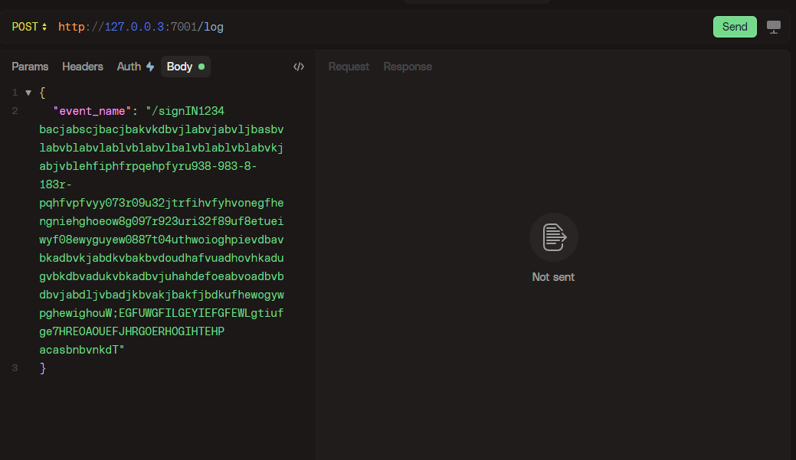

# Getting Started

### Reference Documentation
For further reference, please consider the following sections:

* [Official Apache Maven documentation](https://maven.apache.org/guides/index.html)
* [Spring Boot Maven Plugin Reference Guide](https://docs.spring.io/spring-boot/3.4.2/maven-plugin)
* [Create an OCI image](https://docs.spring.io/spring-boot/3.4.2/maven-plugin/build-image.html)
* [Spring Web](https://docs.spring.io/spring-boot/3.4.2/reference/web/servlet.html)
* [Spring for Apache Kafka](https://docs.spring.io/spring-boot/3.4.2/reference/messaging/kafka.html)
* [Spring Boot Actuator](https://docs.spring.io/spring-boot/3.4.2/reference/actuator/index.html)
* [Spring Boot DevTools](https://docs.spring.io/spring-boot/3.4.2/reference/using/devtools.html)
* [Quartz Scheduler](https://docs.spring.io/spring-boot/3.4.2/reference/io/quartz.html)

### Guides
The following guides illustrate how to use some features concretely:

* [Building a RESTful Web Service](https://spring.io/guides/gs/rest-service/)
* [Serving Web Content with Spring MVC](https://spring.io/guides/gs/serving-web-content/)
* [Building REST services with Spring](https://spring.io/guides/tutorials/rest/)
* [Building a RESTful Web Service with Spring Boot Actuator](https://spring.io/guides/gs/actuator-service/)

### Maven Parent overrides

Due to Maven's design, elements are inherited from the parent POM to the project POM.
While most of the inheritance is fine, it also inherits unwanted elements like `<license>` and `<developers>` from the parent.
To prevent this, the project POM contains empty overrides for these elements.
If you manually switch to a different parent and actually want the inheritance, you need to remove those overrides.

----

## Overview

This log ingestion service is designed to handle high throughput (up to 1k requests per second).
Instead of writing each log entry directly to S3 (MinIO), the service buffers incoming logs locally. 
When the buffered data exceeds a configured size (1KB in this example) or every 10 seconds (via scheduling),
the data is flushed as a batch to the configured MinIO bucket.

### Key Features

- **HTTP Endpoint**: Exposes a `POST /log` endpoint to accept JSON log data.
- **Kafka Integration**: Uses Kafka to decouple log ingestion and processing.
- **Buffering Strategy**: Accumulates logs and flushes them based on size or time interval.
- **MinIO Storage**: Stores batched logs in a MinIO bucket as text files.
- **Dockerized Environment**: Contains Docker Compose configuration for all dependent services 
(Zookeeper, Kafka, MinIO, and the Application).

----

## Architecture

1. **Client Interaction**: Clients send logs as JSON via an HTTP POST request.
2. **Producer Service**: The `LogController` receives the log and sends it to Kafka using the `KafkaProducerService`.
3. **Consumer Service**: A Kafka consumer (`LogConsumer`) listens to the "logs" topic and adds the log to a buffer via the `LogBufferService`.
4. **Buffering & Flushing**: The `LogBufferService` buffers log entries and flushes them to MinIO based on a size threshold or a scheduled interval.
5. **MinIO Upload**: The `MinioService` uploads the batched logs as a file to the specified bucket in MinIO.

----

## Prerequisites

- **Java 21** (or a compatible JDK)
- **Maven** for building the application
- **Docker & Docker Compose** to run the dependent services
- **Apache Bench (ab)** for load testing (installed and accessible in your PATH)
- **MinIO Client (mc)** for verifying log uploads to MinIO (for manual verification)

----

## Setup and Execution

### Docker Environment

1. **Clone the Repository**
``` bash
git clone https://github.com/yourusername/yourproject.git
```

2.**Build the Application**

Build the Spring Boot application using Maven:
``` bash
mvn clean install 
```
3.**Build Docker Images**

The `docker-compose.yml` file is configured to build the application image. To build and run all services, run:
```bash 
docker-compose up --build
```
This command will start the following services:

- **zookeeper:** For Kafka coordination.
- **kafka:** The Kafka broker.
- **minio:** MinIO server for object storage.
- **app:** The Spring Boot log ingestion service.

4.**Access the Service**

Once all containers are up, the log ingestion service will be available at:
```bash 
http://localhost:8087/log
```

## Manual Testing
1.**Using Postman/HTTPie**

You can manually send a log entry:



- this automatically upload login `https://localhost:7001/` url the with bucket-name `logdata` store 
  the `log_timestamp.txt` file if it's greater than 1KB it will upload file every 10 seconds

2.**Load Testing**

A Windows batch file load_test.bat is provided which uses Apache Bench (ab) to simulate load:
- Modify the file if necessary (ensure the paths and URLs are correct).
- Run `load_test.bat` to send multiple requests concurrently.

----

## Testing and Verification
1.**Load Test**

The `load_test.bat` script fires a specified number of concurrent requests (e.g., 1000 requests with 50 concurrent users) to the `/log` endpoint:

```bash
@echo off
set URL=http://localhost:8087/log
set DATA=script\data.json
echo Running load test...
ab -n 1000 -c 50 -p %DATA% -T "application/json" %URL%
pause
```

2.**Log Verification**
Use the verify-logs.bat script to:
- Set up a MinIO alias using the MinIO Client (mc).
- List objects in the MinIO bucket.
- Download the log files locally.
- Count the number of log entries to ensure that all logs have been processed.

Ensure that the MinIO Client (mc) is installed and the paths in the script are correct.


----

## Code Walkthrough
### Main Application
**LogIngestionAppApplication.java**
- The entry point for the Spring Boot application. It enables scheduling to periodically flush the log buffer.

### Controller and Producer
**LogController.java**
- Exposes the POST /log endpoint. It receives log data in JSON format, adds a Unix timestamp, and delegates sending the log to the Kafka topic via the KafkaProducerService.

**KafkaProducerService.java**
- Uses Spring Kafka's KafkaTemplate to publish log messages to the logs topic.

### Kafka Consumer
**LogConsumer.java**
- Listens to the Kafka logs topic (with group ID log-group). It receives log messages and passes them to the LogBufferService for buffering.

### Buffering and MinIO Service
**LogBufferService.java**
- Buffers incoming logs and checks if the buffer size exceeds a threshold (1KB). A scheduled task (every 10 seconds) flushes the buffer to MinIO. Each flush creates a batch file with all buffered logs.

**MinioService.java**
- Handles the interaction with MinIO. It checks if the bucket exists (creating it if necessary) and uploads the batched log file with a filename based on the current timestamp.

### Configuration
**MinioConfig.java**
- Configures the MinIO client using parameters specified in `application.properties.`

**application.properties**
- Contains configuration properties for server settings, Kafka, and MinIO.

----

### Scripts
**data.json**
- Sample JSON log entry used for load testing.

**load_test.bat** 
- Batch file to run Apache Bench load test against the /log endpoint.

**verify-logs.bat**
 - Batch file to verify uploaded log files in MinIO:
   - Sets up a MinIO alias.
   - Lists objects in the configured bucket.
   - Downloads the log files.
   - Counts the total number of log entries.

----
